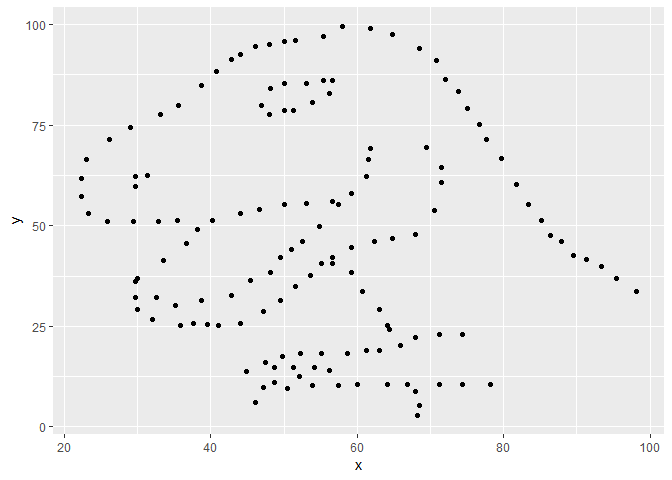
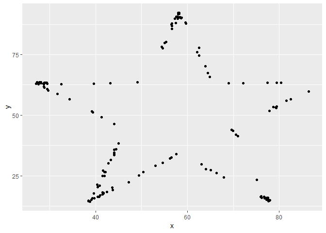
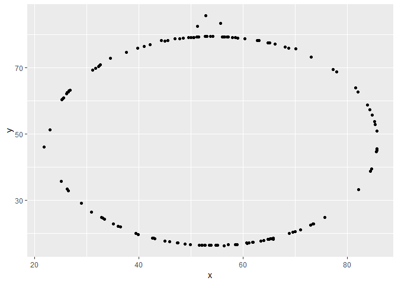
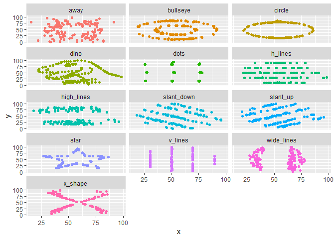

Activity 1.2
================
Antonio Ruiz
June 11, 2019

The Tidyverse Libray
--------------------

``` r
library(tidyverse)
```

    ## -- Attaching packages -------------------------------------------------------------------------------------------------------------------------- tidyverse 1.2.1 --

    ## v ggplot2 3.1.0     v purrr   0.2.5
    ## v tibble  1.4.2     v dplyr   0.7.8
    ## v tidyr   0.8.2     v stringr 1.3.1
    ## v readr   1.3.0     v forcats 0.3.0

    ## Warning: package 'ggplot2' was built under R version 3.5.2

    ## -- Conflicts ----------------------------------------------------------------------------------------------------------------------------- tidyverse_conflicts() --
    ## x dplyr::filter() masks stats::filter()
    ## x dplyr::lag()    masks stats::lag()

Loading DatasauRus
------------------

``` r
library(datasauRus)
```

    ## Warning: package 'datasauRus' was built under R version 3.5.3

``` r
datasaurus_dozen %>% count(dataset) %>% print(13)
```

    ## # A tibble: 13 x 2
    ##    dataset        n
    ##    <chr>      <int>
    ##  1 away         142
    ##  2 bullseye     142
    ##  3 circle       142
    ##  4 dino         142
    ##  5 dots         142
    ##  6 h_lines      142
    ##  7 high_lines   142
    ##  8 slant_down   142
    ##  9 slant_up     142
    ## 10 star         142
    ## 11 v_lines      142
    ## 12 wide_lines   142
    ## 13 x_shape      142

Viewing the dataset
-------------------

``` r
datasaurus_dozen
```

    ## # A tibble: 1,846 x 3
    ##    dataset     x     y
    ##    <chr>   <dbl> <dbl>
    ##  1 dino     55.4  97.2
    ##  2 dino     51.5  96.0
    ##  3 dino     46.2  94.5
    ##  4 dino     42.8  91.4
    ##  5 dino     40.8  88.3
    ##  6 dino     38.7  84.9
    ##  7 dino     35.6  79.9
    ##  8 dino     33.1  77.6
    ##  9 dino     29.0  74.5
    ## 10 dino     26.2  71.4
    ## # ... with 1,836 more rows

Exercise 1 Response:
--------------------

-   Description: A dataset demonstrating the utility of visualization. These 12 datasets are equal in standard measures: mean, standard deviation, and Pearson's correlation.
-   Columns: 3
-   Rows: 1846
-   Each row is a set of coordinates with the respective data set that it belongs to.

Exercise 2
----------

-   Plotting x vs y for the Dino Dataset
-   Correlation: -0.06447185

``` r
dino_data <- datasaurus_dozen %>% filter(dataset =="dino")

ggplot(data=dino_data, mapping=aes(x=x,y=y)) + geom_point()
```



``` r
cor(dino_data$x, dino_data$y)
```

    ## [1] -0.06447185

``` r
dino_data %>% summarize(r = cor(x,y))
```

    ## # A tibble: 1 x 1
    ##         r
    ##     <dbl>
    ## 1 -0.0645

Exercise 3
----------

-   Plotting x vs y for the Star dataset
-   Correlation: -0.0629611
-   Observation: Very similar , slightly 'weaker' correlation compared to the dino data set

``` r
star_data <- datasaurus_dozen %>% filter(dataset =="star")

ggplot(data=star_data, mapping=aes(x=x,y=y)) + geom_point()
```



``` r
cor(star_data$x, star_data$y)
```

    ## [1] -0.0629611

Exercise 4
----------

-   Plotting x vs y for Circle Dataset
-   Correlation: -0.06834336
-   Observation: Slightly higher negative correlation compared to the Dino Dataset

``` r
star_data <- datasaurus_dozen %>% filter(dataset =="circle")

ggplot(data=star_data, mapping=aes(x=x,y=y)) + geom_point()
```



``` r
cor(star_data$x, star_data$y)
```

    ## [1] -0.06834336

Exercise 5 : Exploring Faceting and Group By
--------------------------------------------

-   facet\_wrap wraps a 1d sequence of panels into 2d. This is generally a better use of screen space than facet\_grid() because most displays are roughly rectangular.

``` r
ggplot(data=datasaurus_dozen, aes(x=x, y=y, color=dataset)) +
    geom_point() +
    facet_wrap(~dataset, ncol = 3) + 
    theme(legend.position = "none" )
```



Using GroupBy to generate coefficients
--------------------------------------

``` r
datasaurus_dozen %>% group_by(dataset) %>% summarise(r = cor(x,y))
```

    ## # A tibble: 13 x 2
    ##    dataset          r
    ##    <chr>        <dbl>
    ##  1 away       -0.0641
    ##  2 bullseye   -0.0686
    ##  3 circle     -0.0683
    ##  4 dino       -0.0645
    ##  5 dots       -0.0603
    ##  6 h_lines    -0.0617
    ##  7 high_lines -0.0685
    ##  8 slant_down -0.0690
    ##  9 slant_up   -0.0686
    ## 10 star       -0.0630
    ## 11 v_lines    -0.0694
    ## 12 wide_lines -0.0666
    ## 13 x_shape    -0.0656
